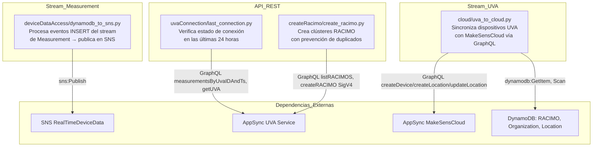

# Módulos Lambda — UVA-App-Integrations

El servicio está organizado en cuatro módulos funcionales separados por responsabilidad. Cada módulo es una función Lambda independiente.

---

## Diagrama de Módulos



---

## Módulo 1: DynamoDBEventProcessorFunction

**Ubicación:** `SAM-UVA-App-Integrations/lambdas/deviceDataAccess/dynamodb_to_sns.py`

**Responsabilidades:**
- Recibir lotes de eventos desde el stream de la tabla Measurement
- Filtrar solo los eventos de tipo `INSERT`
- Transformar el formato DynamoDB (tipos anotados) a JSON nativo Python
- Convertir timestamps ISO 8601 a milisegundos Unix
- Publicar cada medición en el topic SNS con atributos de filtrado

**Disparador:**

```yaml
Tipo: DynamoDB Stream
Stream ARN: arn:aws:dynamodb:us-east-1:913045965320:table/Measurement-{AppId}-{env}/stream/*
Batch Size: 10
Maximum Batching Window: 10 segundos
Starting Position: LATEST
```

**Evento de entrada (ejemplo):**

```json
{
  "Records": [
    {
      "eventName": "INSERT",
      "eventSource": "aws:dynamodb",
      "dynamodb": {
        "NewImage": {
          "id": {"S": "uva123"},
          "type": {"S": "temperature"},
          "ts": {"S": "2024-01-15T10:30:00Z"},
          "data": {"M": {"value": {"N": "36.5"}, "unit": {"S": "celsius"}}},
          "logs": {"L": []}
        }
      }
    }
  ]
}
```

**Funciones principales:**

| Función | Descripción |
|---------|-------------|
| `lambda_handler(event, context)` | Punto de entrada principal |
| `process_data(records)` | Filtra INSERT, extrae NewImage, transforma tipos |
| `remove_data_types(data)` | Convierte formato DynamoDB a tipos Python nativos (S, N, M, L, BOOL) |
| `send_message_to_topic_sns(data)` | Convierte timestamp, publica en SNS con atributos |

**Transformación de datos:**

```python
# Entrada (formato DynamoDB)
{"value": {"N": "36.5"}, "unit": {"S": "celsius"}}

# Salida (JSON nativo)
{"value": 36.5, "unit": "celsius"}
```

**Salida (mensaje SNS publicado):**

```json
{
  "id": "uva123",
  "type": "temperature",
  "ts": 1705318200000,
  "data": {"value": 36.5, "unit": "celsius"},
  "logs": []
}
```

**Atributos SNS:**

| Atributo | Valor | Descripción |
|----------|-------|-------------|
| `typeDevice` | `UVA` | Permite filtrado por tipo de dispositivo |
| `typeData` | `RAW` | Indica datos sin procesar |

**Variables de entorno:**

| Variable | Descripción |
|----------|-------------|
| `TOPIC_SNS_ARN` | ARN del topic SNS RealTimeDeviceData-{env} |

**Dependencias Python:** `boto3==1.34.29`, `json`, `datetime`, `os`

**Características de rendimiento:**
- Arranque en frío: ~2-3 segundos
- Ejecución en caliente: ~200-500ms para 10 registros
- Uso de memoria: ~100-150 MB

**Manejo de errores:**
- Formato de registro inválido: registra el error, omite el registro, continúa
- Fallo en SNS Publish: lanza excepción, Lambda reintenta el lote completo
- Error de conversión de timestamp: registra advertencia, usa timestamp actual

---

## Módulo 2: UvaToCloudFunction

**Ubicación:** `SAM-UVA-App-Integrations/lambdas/cloud/uva_to_cloud.py`

**Responsabilidades:**
- Recibir eventos INSERT y MODIFY del stream de la tabla UVA
- Para INSERT: consultar RACIMO y Organization, crear dispositivo en MakeSensCloud via GraphQL
- Para MODIFY: verificar cambios de ubicación GPS, crear o actualizar Location en MakeSensCloud

**Disparador:**

```yaml
Tipo: DynamoDB Stream
Stream ARN: arn:aws:dynamodb:us-east-1:913045965320:table/UVA-{AppId}-{env}/stream/*
Batch Size: 10
Maximum Batching Window: 10 segundos
Starting Position: LATEST
Event Types: INSERT, MODIFY
```

**Flujo de procesamiento INSERT:**

1. Extraer UVA ID y RACIMO ID del registro
2. `GetItem` en tabla RACIMO para obtener `LinkageCode`
3. `Scan` en tabla Organization con filtro `linkage_code = {code}` para obtener `organizationID`
4. Llamar a mutación GraphQL `createDevice` en AppSync MakeSensCloud

**Flujo de procesamiento MODIFY:**

1. Extraer `latitude` y `longitude` del nuevo registro
2. Validar que ambas coordenadas estén presentes (si falta alguna, se omite)
3. Construir `location_id = "A{uvaID}"`
4. `GetItem` en tabla Location: si existe → `updateLocation`, si no → `createLocation`

**Mutación GraphQL createDevice:**

```graphql
mutation CreateDevice {
  createDevice(
    organizationID: "org123"
    name: "Device Floor 3"
    description: "UVA Device"
    typeDevice: "UVA"
    metadata: "{}"
  ) { id }
}
```

**Variables de entorno:**

| Variable | Descripción |
|----------|-------------|
| `APPSYNC_GRAPHQL_URL` | Endpoint AppSync de MakeSensCloud |
| `APPSYNC_API_KEY` | API Key de MakeSensCloud |
| `RACIMO_TABLE_NAME` | Nombre de la tabla RACIMO-{AppId}-{env} |
| `ORGANIZATION_TABLE_NAME` | Nombre de la tabla Organization-{AppId}-{env} |
| `LOCATION_TABLE_NAME` | Nombre de la tabla Location-{AppId}-{env} |

**Dependencias Python:** `boto3==1.34.29`, `requests==2.31.0`

**Características de rendimiento:**
- Arranque en frío: ~3-4 segundos
- Ejecución en caliente: 1-2 segundos por dispositivo
- Uso de memoria: ~150-200 MB

**Manejo de errores:**

| Escenario | Comportamiento |
|-----------|----------------|
| RACIMO no encontrado | Registra error, omite creación del dispositivo |
| Organization no encontrada | Registra error, omite creación del dispositivo |
| Datos de ubicación incompletos | Omite sincronización de ubicación, continúa |
| Error API GraphQL | Lambda falla, DynamoDB Stream reintenta (máx. 3 intentos) |

---

## Módulo 3: UVALastConnection

**Ubicación:** `SAM-UVA-App-Integrations/lambdas/uvaConnection/last_connection.py`

**Responsabilidades:**
- Recibir solicitudes GET desde API Gateway
- Consultar AppSync por la última medición de uno o múltiples dispositivos UVA
- Comparar el timestamp de la última medición contra las últimas 24 horas
- Retornar el estado de conexión y timestamp

**Disparador:**

```yaml
Tipo: API Gateway REST
Método: GET
Ruta: /{id_uva}/connection
Autorización: AWS_IAM
```

**Modos de consulta:**

```bash
# Dispositivo único
GET /uva123/connection

# Múltiples dispositivos
GET /all/connection?ids=uva1,uva2,uva3
```

**Lógica principal:**

```python
def is_within_last_24_hours(ts_ms):
    current_ms = time.time() * 1000
    diff_ms = current_ms - ts_ms
    return diff_ms <= 86400000  # 24 horas en milisegundos
```

**Fallback:** Si no hay mediciones para el dispositivo, usa la fecha de creación del UVA (`getUVA.createdAt`).

**Consulta GraphQL (medición):**

```graphql
query GetLastMeasurement($uvaID: ID!) {
  measurementsByUvaIDAndTs(uvaID: $uvaID, sortDirection: DESC, limit: 1) {
    items { ts }
  }
}
```

**Consulta GraphQL (fallback):**

```graphql
query GetUVA($id: ID!) {
  getUVA(id: $id) { createdAt }
}
```

**Variables de entorno:**

| Variable | Descripción |
|----------|-------------|
| `APPSYNC_GRAPHQL_URL_USER` | Endpoint AppSync del servicio UVA |
| `APPSYNC_API_KEY_USER` | API Key del servicio UVA |

**Dependencias Python:** `requests==2.31.0`, `json`, `time`, `os`

**Características de rendimiento:**
- Ejecución en caliente: 500-800ms por dispositivo
- Consulta masiva: ~500ms + (100ms × número de dispositivos)
- Uso de memoria: ~100 MB

---

## Módulo 4: CreateRacimo

**Ubicación:** `SAM-UVA-App-Integrations/lambdas/createRacimo/create_racimo.py`

**Responsabilidades:**
- Recibir solicitudes POST desde API Gateway
- Validar que el cuerpo contenga `name` y `linkageCode`
- Consultar AppSync para prevenir creación de RACIMO duplicado
- Crear el nuevo RACIMO con la ruta de configuración estándar si no existe
- Autenticarse en AppSync con AWS SigV4 (sin API Key)

**Disparador:**

```yaml
Tipo: API Gateway REST
Método: POST
Ruta: /CreateRacimo
Autorización: AWS_IAM
```

**Cuerpo de la solicitud:**

```json
{
  "name": "Hospital Floor 3",
  "linkageCode": "HF3-2024-001"
}
```

**Convención de ruta de configuración:**

```
racimos/{linkageCode}/config.json
```

**Firma SigV4:**

```python
from botocore.auth import SigV4Auth
from botocore.awsrequest import AWSRequest

credentials = boto3.Session().get_credentials()
request = AWSRequest(method='POST', url=endpoint, data=body, headers=headers)
SigV4Auth(credentials, 'appsync', 'us-east-1').add_auth(request)
```

**Consulta de existencia:**

```graphql
query CheckRACIMO($linkageCode: String!) {
  listRACIMOS(filter: {LinkageCode: {eq: $linkageCode}}) {
    items { id name LinkageCode path }
  }
}
```

**Mutación de creación:**

```graphql
mutation CreateRACIMO($input: CreateRACIMOInput!) {
  createRACIMO(input: $input) { id name LinkageCode path }
}
```

**Variables de entorno:**

| Variable | Descripción |
|----------|-------------|
| `APPSYNC_GRAPHQL_URL_USER` | Endpoint AppSync del servicio UVA |

**Dependencias Python:** `boto3==1.34.29`, `botocore==1.34.29`, `requests==2.31.0`, `json`, `os`

**Escenarios de error:**

| Escenario | Código | Respuesta |
|-----------|--------|-----------|
| Campos faltantes | 400 | `{"error": "Missing required fields"}` |
| Error en consulta GraphQL | 500 | `{"error": "Failed to check RACIMO"}` |
| Error en creación GraphQL | 500 | `{"error": "Failed to create RACIMO"}` |
| Fallo de autenticación | 403 | Error estándar de API Gateway AWS |

---

## Configuración Global Lambda

```yaml
Globals:
  Function:
    Runtime: python3.9
    MemorySize: 520       # MB
    Timeout: 600          # Segundos (10 minutos)
    Architectures:
      - x86_64
```

---

## Monitoreo y Alertas

| Métrica | Umbral | Acción |
|---------|--------|--------|
| Errores de Lambda | > 5% | Notificar al ingeniero de guardia |
| Duración de Lambda | > 30s | Investigar rendimiento |
| IteratorAge del Stream | > 10min | Verificar throttling de Lambda |
| Ejecuciones Concurrentes | > 900 | Revisar límites de cuenta |
| Fallos de Publicación SNS | > 0 | Verificar permisos del topic |
