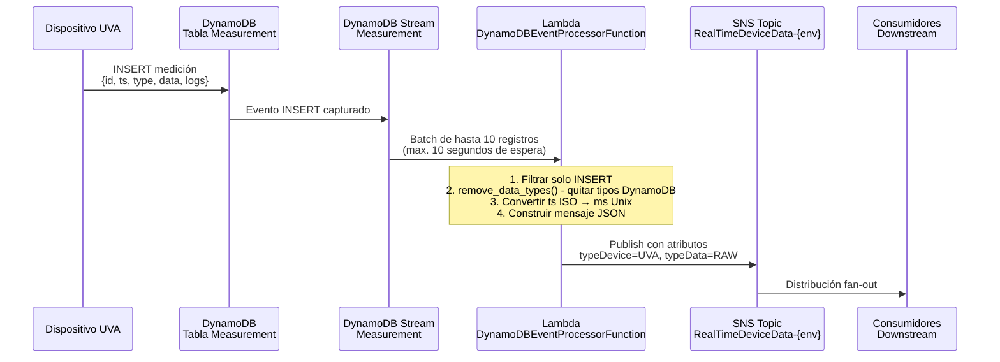
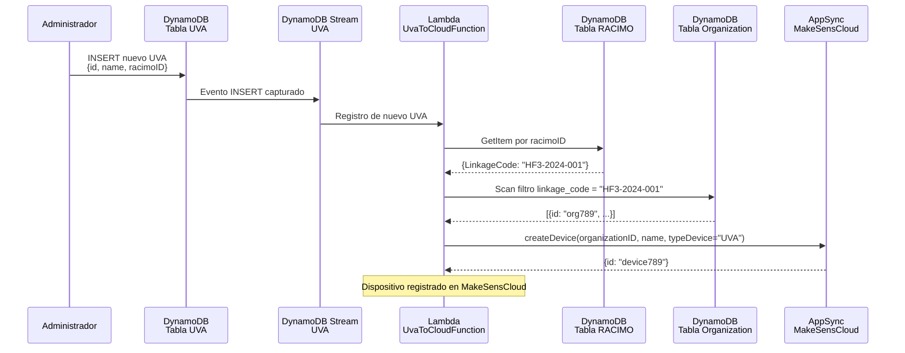
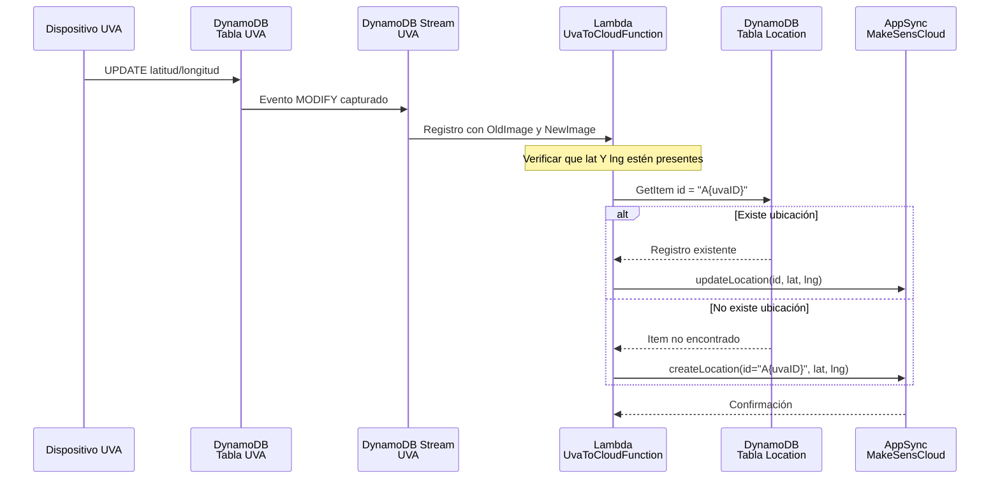
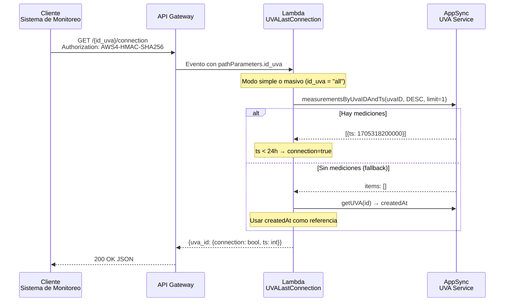
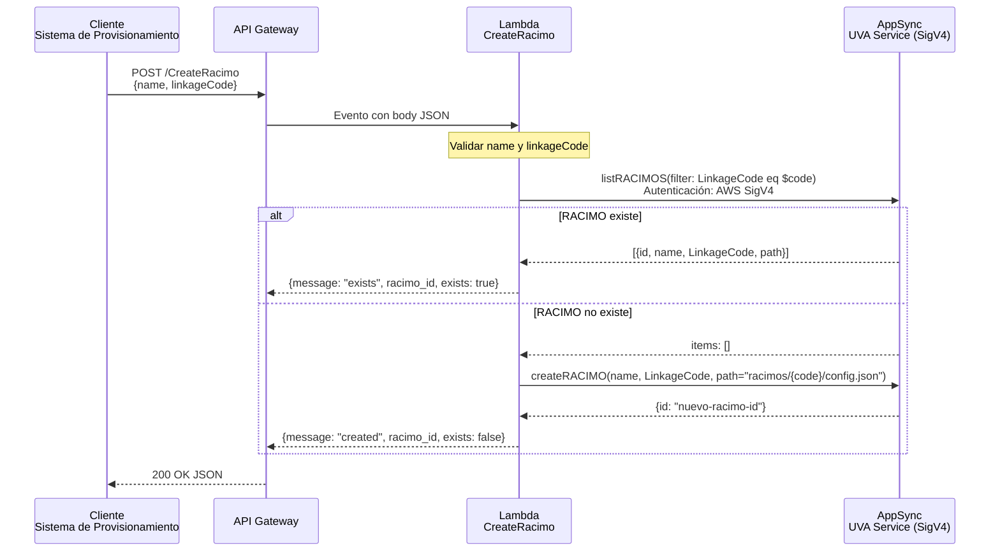
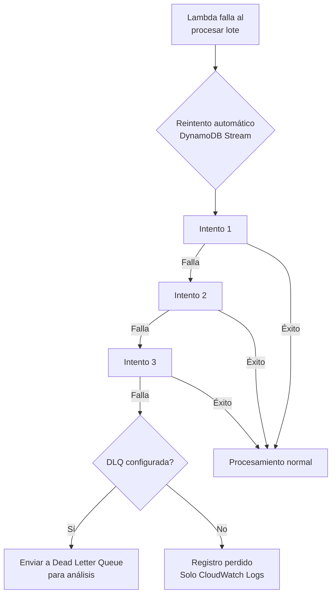
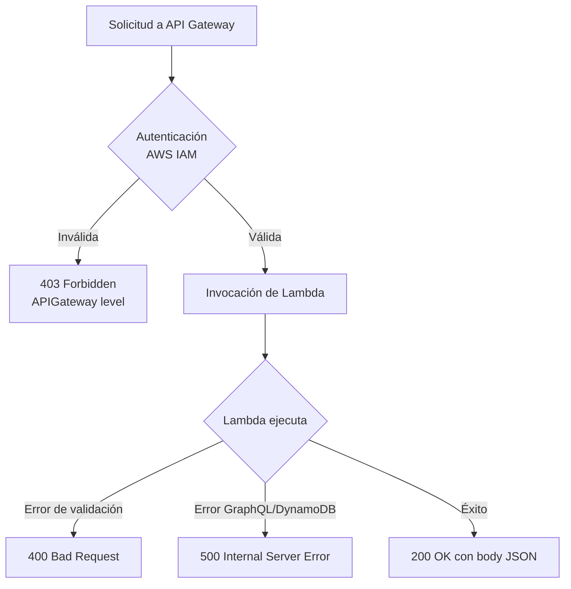

# Flujo de Datos — UVA-App-Integrations

---

## Flujo de Datos Extremo a Extremo

El servicio gestiona cuatro flujos de datos diferenciados, cada uno disparado por una fuente de evento distinta.

---

## Flujo 1: Procesamiento de Mediciones en Tiempo Real



**Transformación de datos:**

```
Entrada DynamoDB:                    Salida SNS:
{                                    {
  "id": {"S": "uva123"},               "id": "uva123",
  "type": {"S": "temperature"},        "type": "temperature",
  "ts": {"S": "2024-01-15T10:30:00Z"}, "ts": 1705318200000,
  "data": {"M": {                      "data": {
    "value": {"N": "36.5"}               "value": 36.5
  }}                                   }
}                                    }
```

---

## Flujo 2: Sincronización de Dispositivos a la Nube (INSERT)



---

## Flujo 3: Sincronización de Ubicación (MODIFY)



---

## Flujo 4: Verificación de Estado de Conexión



---

## Flujo 5: Creación de Clúster RACIMO



---

## Flujo de Error: Stream Fallo en Lambda



---

## Flujo de Error: API Gateway



---

## Latencias Estimadas por Flujo

| Flujo | Fase | Duración aproximada |
|-------|------|---------------------|
| **Flujo 1: Medición→SNS** | Escritura DynamoDB | < 10ms |
| | Latencia del Stream | < 1s |
| | Lambda (warm) | 200-500ms |
| | **Total warm** | **~1-2s** |
| | **Total cold start** | **~4-5s** |
| **Flujo 2: UVA→Cloud (INSERT)** | Lambda (warm) | 1-2s |
| | Llamadas GraphQL | ~500ms |
| **Flujo 4: Estado de conexión** | Lambda (warm) | 500-800ms |
| | **Consulta masiva** | **500ms + 100ms × N dispositivos** |
| **Flujo 5: Creación RACIMO** | Lambda (warm, existe) | ~800ms |
| | Lambda (warm, crea) | 1.5-2s |

---

## Throughput Máximo

| Flujo | Throughput |
|-------|------------|
| Procesamiento de Mediciones | 1000 eventos/seg (limitado por shards del stream) |
| Sincronización de Dispositivos | 100 dispositivos/seg (limitado por GraphQL rate limits) |
| Verificación de Conexión | 50 req/seg (limitado por rendimiento AppSync) |
| Creación de RACIMO | 20 req/seg (limitado por mutación + consulta GraphQL) |
