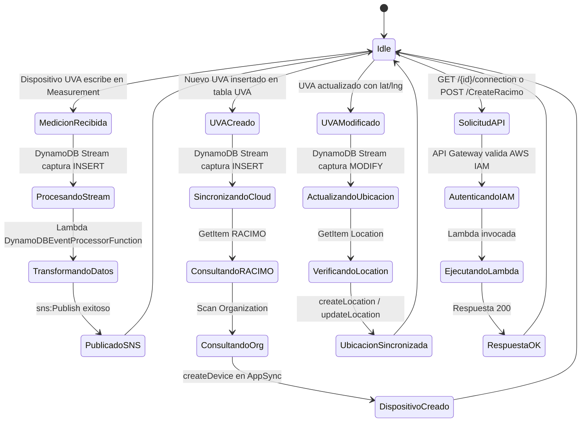

# Flujo Operacional — UVA-App-Integrations

---

## Ciclo de Operación Normal



---

## Timing del Ciclo

| Flujo | Fase | Duración (warm) | Duración (cold start) |
|-------|------|-----------------|----------------------|
| Medición → SNS | Latencia del stream | < 1s | — |
| | DynamoDBEventProcessorFunction | 200-500ms | ~2-3s |
| | **Total** | **~1-2s** | **~4-5s** |
| UVA INSERT → Cloud | UvaToCloudFunction | 1-2s | ~3-4s |
| | **Total (con GraphQL)** | **~2-3s** | **~5-6s** |
| GET /connection | UVALastConnection | 500-800ms | ~2s |
| POST /CreateRacimo | CreateRacimo (existe) | ~800ms | ~2-3s |
| POST /CreateRacimo | CreateRacimo (crea) | 1.5-2s | ~3-4s |

---

## Manejo de Errores

### Errores en Lambdas Disparadas por Stream

| Escenario | Comportamiento | Registro |
|-----------|----------------|---------|
| Formato de registro DynamoDB inválido | Registra error, omite el registro, continúa con el lote | CloudWatch Logs |
| Fallo en SNS Publish | Lambda lanza excepción, DynamoDB Stream reintenta | CloudWatch Logs + Métricas Lambda |
| RACIMO no encontrado en tabla | Registra error, omite creación del dispositivo | CloudWatch Logs |
| Organization no encontrada | Registra error, omite creación del dispositivo | CloudWatch Logs |
| Datos de ubicación incompletos (falta lat o lng) | Omite sync de ubicación, continúa con el registro | CloudWatch Logs |
| Error en mutación GraphQL | Lambda falla, DynamoDB Stream reintenta (máx. 3 intentos) | CloudWatch Logs |
| Timeout Lambda (> 600s) | Lambda abortada, DynamoDB Stream reintenta | CloudWatch Metrics + Logs |

### Reintentos del DynamoDB Stream

```
Primer intento → Fallo
    ↓
Segundo intento (backoff exponencial)
    ↓
Tercer intento
    ↓
Si DLQ configurada → Enviar a Dead Letter Queue
Si DLQ no configurada → Registro perdido (solo CloudWatch Logs)
```

**Configuración actual:** Sin DLQ configurada. Se recomienda agregar SQS DLQ para auditoría de fallos.

### Errores en Lambdas de API Gateway

| Escenario | Código HTTP | Comportamiento |
|-----------|-------------|----------------|
| Autenticación IAM inválida | 403 | API Gateway rechaza antes de invocar Lambda |
| Campos faltantes en body | 400 | Lambda valida y retorna error descriptivo |
| Error en consulta GraphQL | 500 | Lambda retorna error con detalle |
| Error en mutación GraphQL | 500 | Lambda retorna error con detalle |
| UVA ID no encontrado | 200 | Fallback a fecha de creación del UVA |

---

## Limitaciones Conocidas

1. **Sin buffer offline para mediciones:** Si SNS no está disponible, los datos de medición se pierden permanentemente. No hay lógica de reintento en `DynamoDBEventProcessorFunction` para fallos de SNS más allá del reintento del stream.

2. **Scan de Organization ineficiente:** La búsqueda de organización por `linkage_code` usa un Scan completo de la tabla, lo que escala linealmente con el número de organizaciones.

3. **API Keys en texto plano:** Las API Keys de AppSync están almacenadas en `parameters.json` y se pasan como parámetros SAM en texto plano. No hay rotación automática.

4. **Sin DLQ en Lambdas de stream:** Los registros que fallen los 3 reintentos se pierden sin registro de auditoría persistente.

5. **Sin validación de rangos de datos:** No hay validación de rangos de valores físicos en los datos de medición.

6. **Timeout de 600s:** Si el procesamiento de un lote del stream tarda más de 10 minutos, la Lambda se aborta y reintenta, potencialmente procesando el mismo lote múltiples veces.

---

## Posibles Mejoras

1. **Agregar GSI a tabla Organization** en el campo `linkage_code` para eliminar el Scan costoso y reemplazarlo por una Query O(1).

2. **Configurar SQS DLQ** en las Lambdas disparadas por stream para capturar y auditar registros que fallen todos los reintentos.

3. **Migrar API Keys a AWS Secrets Manager** con rotación automática, eliminando las credenciales del `parameters.json`.

4. **Implementar TTL en tabla Measurement** para limitar el crecimiento indefinido de datos históricos:
   ```python
   item['expirationTime'] = int(time.time()) + (90 * 24 * 60 * 60)  # 90 días
   ```

5. **Agregar filtro de eventos en DynamoDB Stream de UVA** para solo invocar la Lambda en eventos MODIFY que cambien `latitude` o `longitude`, reduciendo invocaciones innecesarias.

6. **Configurar concurrencia provisionada** en Lambdas de API Gateway para eliminar cold starts y garantizar latencia consistente.

7. **Agregar alarmas de CloudWatch** para errores de Lambda, IteratorAge del stream, y errores 5XX en API Gateway.

8. **Implementar retry con backoff exponencial** en las llamadas a AppSync desde `UvaToCloudFunction` y `CreateRacimo`.

---

## Tareas de Mantenimiento

### Semanales
- Revisar CloudWatch Logs en busca de errores recurrentes
- Verificar `GetRecords.IteratorAgeMilliseconds` (alertar si > 10 minutos)
- Revisar métricas de duración de Lambda (investigar si > 30 segundos)

### Mensuales
- Revisar costos de CloudWatch Logs (ajustar retención si necesario)
- Actualizar dependencias Python (`boto3`, `requests`)
- Rotar API Keys de AppSync

### Trimestrales
- Revisar permisos IAM (principio de mínimo privilegio)
- Evaluar actualización del runtime Python (actualmente 3.9)
- Ejecutar pruebas de carga en endpoints API

---

## Comandos de Diagnóstico

```bash
# Ver logs recientes de todas las Lambdas
aws logs tail /aws/lambda/DynamoDBEventProcessorFunction --follow
aws logs tail /aws/lambda/UvaToCloudFunction --follow
aws logs tail /aws/lambda/UVALastConnection --follow
aws logs tail /aws/lambda/CreateRacimo --follow

# Verificar métricas de errores Lambda (últimas 24h)
aws cloudwatch get-metric-statistics \
  --namespace AWS/Lambda \
  --metric-name Errors \
  --dimensions Name=FunctionName,Value=DynamoDBEventProcessorFunction \
  --start-time $(date -u -v-1d +%Y-%m-%dT%H:%M:%SZ) \
  --end-time $(date -u +%Y-%m-%dT%H:%M:%SZ) \
  --period 3600 \
  --statistics Sum

# Verificar IteratorAge del stream
aws cloudwatch get-metric-statistics \
  --namespace AWS/Lambda \
  --metric-name IteratorAge \
  --dimensions Name=FunctionName,Value=DynamoDBEventProcessorFunction \
  --start-time $(date -u -v-1h +%Y-%m-%dT%H:%M:%SZ) \
  --end-time $(date -u +%Y-%m-%dT%H:%M:%SZ) \
  --period 300 \
  --statistics Maximum

# Verificar el estado del stack
aws cloudformation describe-stacks \
  --stack-name SAM-UVA-App-Integrations-main \
  --query "Stacks[0].StackStatus"

# Invocar función localmente para diagnóstico
sam local invoke DynamoDBEventProcessorFunction -e events/test-event.json
sam local invoke UVALastConnection -e events/api-event.json
```

---

## Estimación de Costos Mensuales

| Servicio | Uso estimado | Costo aproximado |
|---------|--------------|-----------------|
| AWS Lambda | 10M invocaciones, 500ms avg, 520MB | ~$20-30/mes |
| DynamoDB Streams | Incluido con DynamoDB | $0 |
| API Gateway | 1M llamadas/mes | ~$3.50/mes |
| CloudWatch Logs | 10GB ingesta, 7 días retención | ~$2-5/mes |
| SNS | 1M mensajes/mes | ~$0.50/mes |
| **Total estimado** | | **~$26-39/mes** |

*Excluyendo costos de DynamoDB y AppSync (administrados externamente)*

### Optimización de Costos

1. Implementar retención de CloudWatch Logs (7-30 días) — reduce costos 70-90%
2. Evaluar reducir MemorySize Lambda de 520MB a 256-384MB si el consumo real es menor
3. Habilitar caché en API Gateway para endpoint `/connection` (60 segundos TTL)
